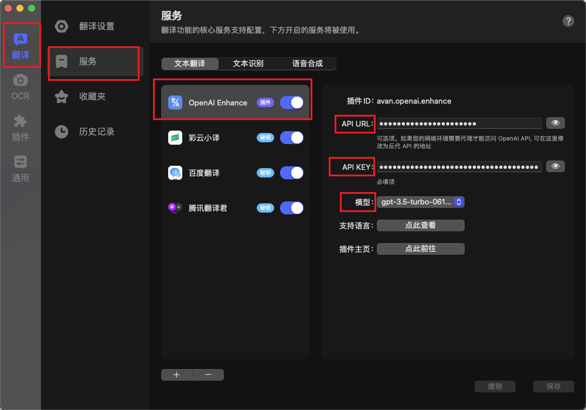

# Bob Plugin OpenAI Enhance

English | [简体中文](./README-zh_CN.md)

## Introduction

OpenAI Translation Enhancement Bob Plugin.

## Download

[Latest Version](https://github.com/Layouwen/bob-plugin-openai-enhance/releases/download/v0.0.3-alpha.6/openai-enhance-0.0.3-alpha.6.bobplugin)

## Installation

1. Navigate to the downloaded folder.
2. Double-click to open the `openai-enhance-[version].bobplugin` file.

## Add Service

`Translate` -> `Service` -> `Text Translation` -> `+` -> `OpenAI Enhance`

## Configuration

| Configuration | Description                                                             |
| ------------- | ----------------------------------------------------------------------- |
| API URL       | OpenAI API URL, leave blank for default official API or enter proxy URL |
| API Key       | OpenAI API Key, obtain from [OpenAI](https://beta.openai.com/) website  |
| Model         | Select the desired model                                                |

The above is the README document on GitHub. Please translate it while preserving the format into English.
